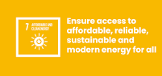

# Data wrangling on data for Analysis on  progress towards SDG7 
## By Hafsah Anibaba

<b>This project is and analysis on global progress toward acheiving all the the set targets towards SDG7. 
    Sustainable Development Goal 7(SDG7) calls for "affordable, reliable, sustainable and modern energy for all" by 2030. Its 3 core targets are:
    * Ensure universal access to affordable, reliable and modern energy services.
    * Increase substantially the share of renewable energy in the global energy mix.
    * Double the global rate of improvement in energy efficiency
    The targets of this goal.

#### Methodology 
  - I extracted data on indicators I need to analyse the progress towards the goal  so far.
  - I cleaned the data and also made observations of country that had years of no record and countries that had no missing data
        
        
        
  - I saved the extracted and cleaned data in this [folder](https://github.com/Hafsah2020/analysis-on-sdg7/tree/main/data/extracted_data)
