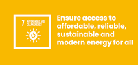

## Analysis on  progress towards SDG7 
### By Hafsah Anibaba

# Hello :wave:

This file was generated on 2022-08-24 by <b>Hafsah Anibaba</b>

<b>This project is an analysis on global progress toward acheiving all the the set targets towards SDG7. 
    Sustainable Development Goal 7(SDG7) calls for "affordable, reliable, sustainable and modern energy for all" by 2030. Its 3 core targets are:
    * Ensure universal access to affordable, reliable and modern energy services.
    * Increase substantially the share of renewable energy in the global energy mix.
    * Double the global rate of improvement in energy efficiency
    The targets of this goal.</b>
    
    
#### Dataset used: This data was retrieved from the worldbank website through this [link](https://databank.worldbank.org/source/world-development-indicators#)
The data has trend on the indicators of SDGs for all countries from year 1960 to 2021

#### Methodology
 - Business Understanding: Where should more work be done to help reach the core targets.
 - Analytics Understanding: Which countries are already or almost at the goal?   Which countries are lagging 
 - Data requirements: Data on all relevant indicators of SDG7 for all countries and that is why I chose the data from world bank 
 - Data preparation: I had wrangle the data [here](https://github.com/Hafsah2020/analysis-on-sdg7/tree/main/Data_wrangling_on_progress_towards_SDG7)
 - Analysis: After I had wrangled the data I made analyses to answer the business and analytics questions [here](https://github.com/Hafsah2020/analysis-on-sdg7/tree/main/Analysis_on_progress_towards_SDG7)
